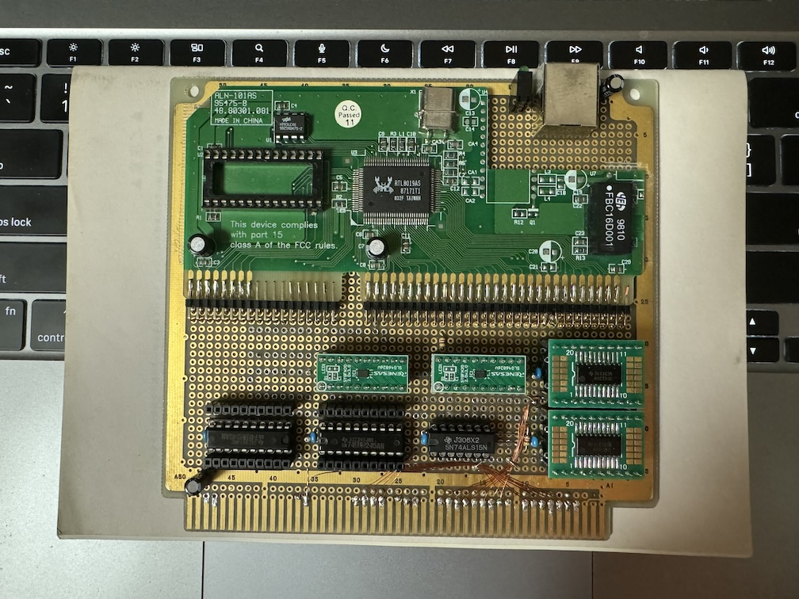
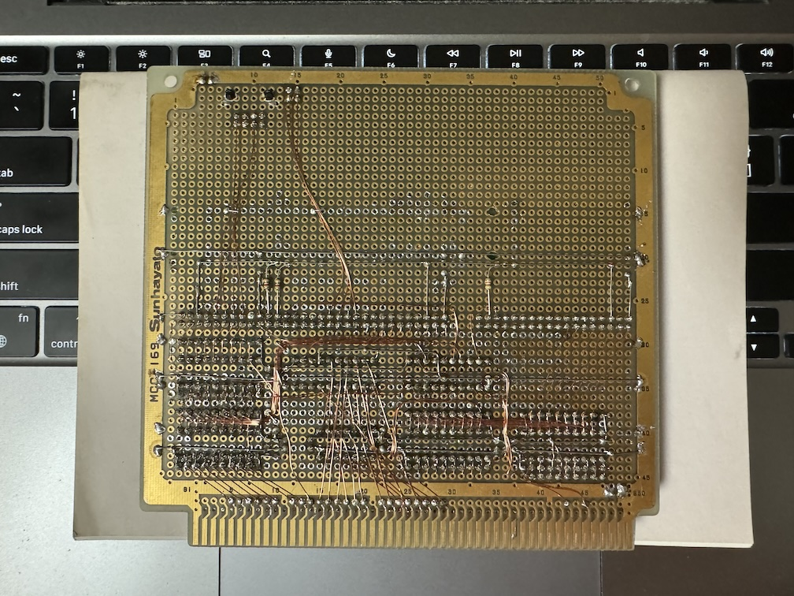

# Neptune-X
An Implementation of Neptune-X: Network Interface Card for X680x0

# Overview
The logic consisted mainly of an address decoder and an ISA bus bridge, the former implemented using one GreekPAK (SLG46826V-DIP) and one 74ALS15, the latter using another GreenPak. Note that some output pins are set to 'open drain'.

- neptune-x-adrdec.gp6: address decorder, a9-a8 buffer, reset inverter
- neptune-x-bridge.gp6: ISA bus bridge, irq inverter

The other parts (74ALS245 x2, 74AHCT245 x2) are tri-state bus buffers for address and data, some of which could be omitted.

The following items are RTL8019AS settings:
- Pull-up JP pin to set jumper mode (Cut under R3 'silk' and pull-up it)
- Pull-up IRQS2 pin to set interrupt line (Wire pin 16 and 28 of U2 using 4.7k ohm register)

I forgot to mention, cut the NE2000 card into a bite-size piece.

# TODO
- Adjust timing in 68030 mode of Xellent30s

# Links
- Original Design  
  [Neptune-X Home Page](http://www.amy.hi-ho.ne.jp/shimada/neptune/)

- Implementation Example  
  [Applause's Neptune-X](https://applause.elfmimi.jp/neptune-x/)

- Idea to ommit bus buffers  
  [Neptune-X Compatible Simple LAN Board Production](https://nfggames.com/X68000/Schematics/Neptune-X/S.Ueda/XLANBD.pdf)
